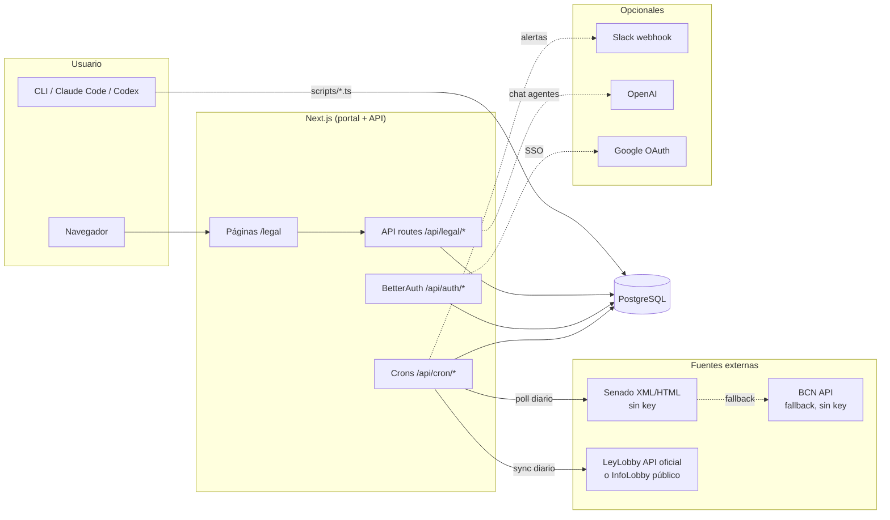
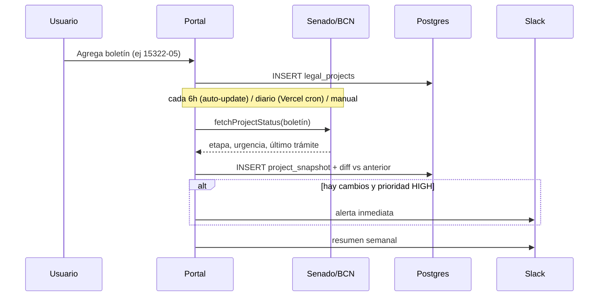

# Arquitectura

Este documento explica cómo está construido Radar Legislativo, cómo fluyen los datos y cómo se usa de punta a punta. Para instalación y variables de entorno, ver el [README](./README.md).

## Visión general

Radar Legislativo es una app **Next.js (Pages Router)** con **PostgreSQL** que hace dos cosas:

1. **Seguimiento de proyectos de ley**: guardas los boletines que te interesan; la app consulta periódicamente las fuentes públicas del Congreso, guarda una foto (*snapshot*) del estado de cada proyecto, y detecta cambios entre fotos (cambio de etapa, urgencia, comisión, último trámite). Los cambios relevantes disparan alertas a Slack.
2. **Registro de lobby**: sincroniza las audiencias de la Ley de Lobby (20.730), las hace explorables (por institución, persona, materia) y las cruza con tus proyectos de ley.



## Modelo de datos

| Tabla | Qué guarda |
|---|---|
| `legal_projects` | Los proyectos de ley que decidiste seguir: boletín, título, prioridad (HIGH/MEDIUM/LOW), notas, metadata |
| `project_snapshots` | Una fila por cada consulta al Congreso: etapa, cámara, urgencia, último trámite, y el diff `changes_detected` contra el snapshot anterior |
| `project_cache` | Cache local del catálogo de proyectos del Senado (para el buscador y el agente de investigación) |
| `lobby_audiencias` | Audiencias de lobby sincronizadas, con texto de búsqueda precalculado |
| `user`, `session`, `account`, `verification` | Tablas de BetterAuth |

## Flujos principales

### 1. Seguimiento de un proyecto de ley



- Scraper: `lib/legal/congress-scraper.ts` (Senado primero, BCN como fallback; si ambos fallan **lanza error** — nunca guarda un snapshot vacío).
- Diff: `lib/legal/diff-engine.ts` compara snapshot nuevo vs anterior campo a campo.
- Notificaciones: `lib/legal/slack-notifier.ts`.
- Entradas: auto-updater integrado (`instrumentation.ts` → `lib/legal/auto-updater.ts`, cada `AUTO_UPDATE_INTERVAL_HOURS` horas en local/self-hosted), cron `/api/cron/legal-poll` (Vercel, diario), `/api/legal/poll` (manual con API key), botón "Actualizar" por proyecto (`/api/legal/projects/[id]/refresh`).

### 2. Sincronización de lobby

- `lib/legal/leylobby-service.ts`: API oficial (requiere `LEYLOBBY_API_KEY` + códigos de institución).
- `lib/legal/infolobby-service.ts`: feed público de InfoLobby (fallback sin key).
- Entradas: auto-updater integrado (mismo ciclo que el poll), cron `/api/cron/lobby-sync` (Vercel, diario), botón de sincronizar en la pestaña Lobby, o `bun run scripts/sync-lobby.ts`.
- Si una audiencia nueva involucra instituciones clave (CMF, Banco Central, etc.), se notifica a Slack.
- El cruce lobby ↔ proyectos (`/api/legal/lobby/crossref`) busca menciones de boletines y materias comunes.

### 3. Agentes de análisis (opcional, requiere `OPENAI_API_KEY`)

Dos endpoints de chat con *function calling* sobre la base de datos:
- `/api/legal/projects/chat`: busca proyectos, lee historial de cambios, puede enviar alertas a Slack.
- `/api/legal/lobby/chat`: estadísticas y cruces sobre audiencias.

## Mapa del código

```
pages/
  legal/index.tsx        ← dashboard (pestañas Inicio / Proyectos / Lobby / Investigación)
  legal/projects/…       ← alta manual y detalle de proyectos
  legal/changes.tsx      ← timeline de cambios detectados
  api/legal/projects/…   ← CRUD + refresh + chat
  api/legal/lobby/…      ← búsqueda, analytics, crossref, sync, chat
  api/cron/…             ← jobs diarios (Vercel cron, ver vercel.json)
  api/auth/[...all].ts   ← BetterAuth (login, SSO Google)
components/legal/        ← componentes del dashboard
lib/legal/               ← scrapers, diff, notificaciones, servicios de lobby
lib/api/                 ← protectedHandler (auth + rate limit), cron-auth, rate-limit
db/schema/               ← tablas Drizzle; migraciones generadas en drizzle/
scripts/                 ← create-user, seeds, syncs manuales
```

Convenciones de seguridad: **todo endpoint de datos usa `protectedHandler`** (sesión + rate limit por usuario/ruta); los crons validan `CRON_SECRET` fail-closed; detalles en la sección Seguridad del README.

## Cómo se usa, paso a paso

### Opción A: con un agente (Claude Code, Codex, Cursor…)

El repo incluye `CLAUDE.md` / `AGENTS.md` con las convenciones del proyecto, así que un agente de código puede operarlo directo. Flujo típico:

1. **Levantar**: pídele al agente *"levanta el proyecto"* — va a correr `docker compose up -d`, `./scripts/setup.sh` (crea `.env` con secreto generado, instala deps, migra) y `bun run dev`.
2. **Crear tu usuario**: *"créame un usuario admin@miempresa.com"* → `bun run scripts/create-user.ts admin@miempresa.com 'clave' 'Nombre'`.
3. **Cargar proyectos**: *"agrega los boletines 15322-05 y 16821-19 al tracker con prioridad alta"* — el agente puede insertarlos vía la página `/legal/projects/new`, la API, o un seed. También puedes pedirle *"busca en el Senado proyectos sobre protección de datos y agrégalos"* (usa `scripts/bulk-sync.ts` + el buscador del cache).
4. **Seguimiento**: la actualización automática hace el resto (cada 6h con la app corriendo; diaria en Vercel); puedes forzarla con `curl -X POST /api/legal/poll -H "x-api-key: …"`.
5. **Lobby**: *"sincroniza las audiencias de lobby"* → `bun run scripts/sync-lobby.ts`.

### Opción B: manual

```bash
./scripts/setup.sh   # hace todo: DB (Docker), .env, deps, migraciones,
                     # tu usuario (interactivo) y datos de ejemplo
bun run dev          # http://localhost:3000 → login → /legal
```

Scripts sueltos si los necesitas después: `create-user.ts` (más cuentas), `sync-lobby.ts` (audiencias), `bulk-sync.ts` (cache del buscador del Senado).

Desde el portal: pestaña **Proyectos** para ver el radar y agregar boletines nuevos, **Lobby** para explorar audiencias, **Investigación** para el chat con IA (si configuraste OpenAI).

### Producción (Vercel)

El deploy en Vercel activa los crons de `vercel.json` (poll de proyectos y sync de lobby, diarios); para más frecuencia está el workflow `.github/workflows/auto-update.yml` (cada 6h vía GitHub Actions, requiere secrets `APP_URL` y `CRON_SECRET`). Configura las env vars y aplica migraciones contra tu Postgres productivo; guía completa en el README.
