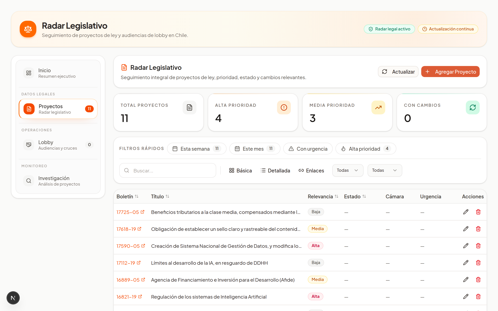
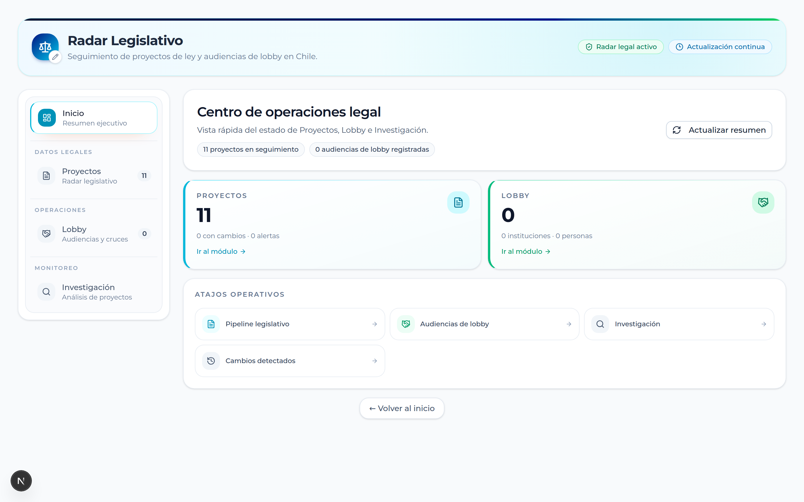
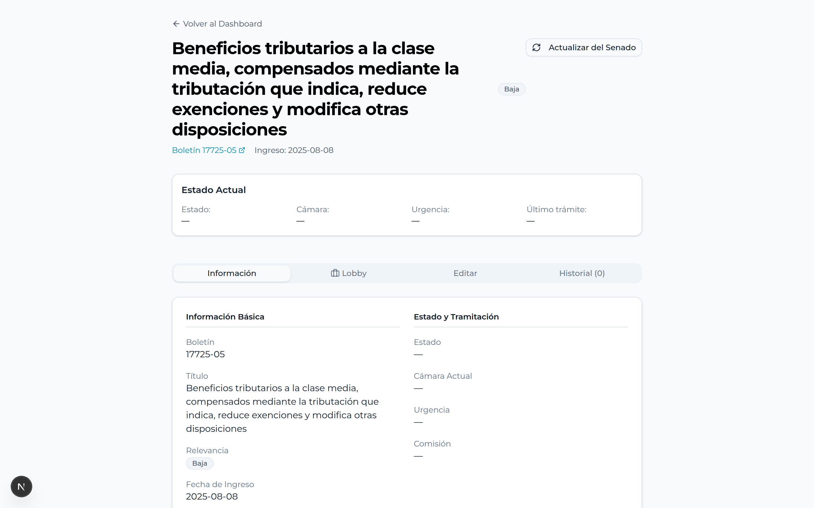

# Radar Legislativo

[](https://github.com/raimundo-hp67/Radar-legislativo/actions/workflows/ci.yml)
[](./LICENSE)


Seguimiento de **proyectos de ley del Congreso de Chile** y **audiencias de lobby** (Ley 20.730), con detección de cambios, alertas a Slack y agentes de análisis con IA.



<details>
<summary>📸 Más capturas: resumen ejecutivo y detalle de proyecto</summary>





</details>

## Empezar en 3 pasos

Solo necesitas [Bun](https://bun.sh/docs/installation) y [Docker Desktop](https://docs.docker.com/get-docker/) instalados. **No se necesita ninguna API key** para partir.

```bash
git clone https://github.com/raimundo-hp67/Radar-legislativo.git
cd Radar-legislativo
./scripts/setup.sh
```

El instalador hace todo solo: inicia la base de datos, crea la configuración, aplica migraciones, levanta el portal y **abre tu navegador automáticamente**. La primera vez verás una pantalla para **crear tu cuenta** (nombre, email y contraseña) ahí mismo — la llenas y entras directo. No necesitas hacer nada más en la terminal.

Para apagarla, presiona `Ctrl + C` en esa ventana. Para volver a levantarla otro día: `bun run dev:open` (o `bun run dev` si no quieres que abra el navegador solo).

> 🧭 **¿Nunca has usado una terminal?** Sigue la **[guía de instalación paso a paso](./docs/INSTALACION.md)**, escrita para personas sin experiencia en código (incluye cómo instalar Bun, Docker y Git, y cómo mantener los datos actualizados).

> 💡 Si usas un agente de código (Claude Code, Codex, Cursor), basta con pedirle *"levanta el proyecto y créame un usuario"* — el repo incluye `CLAUDE.md`/`AGENTS.md` con todo el contexto que necesita.

## Funcionalidades

- **Radar legislativo**: seguimiento de proyectos de ley por boletín, con estado, etapa, urgencia, comisión y detección automática de cambios (snapshots + diff).
- **Lobby**: sincronización de audiencias de lobby desde la API oficial de [Ley de Lobby](https://www.leylobby.gob.cl) (o el feed público de InfoLobby como fallback), con explorador, analytics y cruces institución ↔ organización/persona ("¿quién se reúne con quién?").
- **Alertas**: notificaciones a Slack ante cambios en proyectos de alta prioridad y nuevas audiencias en las instituciones que tú vigiles, más un resumen periódico.
- **Investigación**: agentes de chat (OpenAI) para analizar proyectos y audiencias en lenguaje natural.

📖 ¿Boletín? ¿Relevancia HIGH? ¿Snapshot? → **[Glosario](./docs/GLOSARIO.md)** con cada término y su efecto en la herramienta.

## Adaptar el radar a tu tema

El proyecto se distribuye configurado para **regulación financiera/fintech como ejemplo**, pero sirve para cualquier área (salud, minería, educación, medio ambiente…). Todo lo temático vive en **un solo archivo**: [`config/radar.config.ts`](./config/radar.config.ts):

| Qué defines ahí | Controla |
|-----------------|----------|
| `searchKeywords` | Keywords por defecto del buscador de proyectos |
| `lobbyWatchKeywords` | Qué instituciones disparan alertas de lobby a Slack |
| `cacheSeedBoletines` | Boletines del refresco rápido del cache |
| `lobbySearchTargets` | Búsquedas temáticas de audiencias |
| `suggestedQuestions` / `quickKeywords` / `lobbySuggestedQuestions` | Preguntas y chips sugeridos en los chats de IA |

Edita las listas, reinicia la app, y el radar es tuyo. Los proyectos de ley que sigues los eliges tú siempre (por boletín); esta config solo define defaults y alertas.

Además, **puedes subir tu propio logo desde la interfaz**: pasa el mouse sobre el ícono del encabezado del dashboard y pulsa el lápiz (PNG, JPG o WebP, máx 2 MB). Queda guardado en la base de datos y lo ven todos los usuarios del portal.

## Stack

Next.js 16 (Pages Router) · TypeScript · Bun · PostgreSQL + Drizzle ORM · Tailwind CSS v4 + shadcn/ui · BetterAuth

📐 **[ARCHITECTURE.md](./ARCHITECTURE.md)** explica cómo funciona todo: diagramas, flujos de datos, mapa del código y la guía de uso paso a paso (incluyendo cómo operarlo con un agente tipo Claude Code / Codex).

---

## Qué se necesita para que funcione

### Requisitos mínimos (sin ninguna API key)

Lo único indispensable es **Postgres** y un **secreto de sesión**. Con eso ya funciona: el tracking de proyectos usa la **API XML pública del Senado** (no requiere key) y el lobby usa el **feed público de InfoLobby** (tampoco requiere key).

| Variable | Requerida | Para qué |
|----------|-----------|----------|
| `DATABASE_URL` | ✅ (tiene default local) | Conexión a Postgres |
| `BETTER_AUTH_SECRET` | ✅ | Sesiones de usuarios (mín. 32 caracteres) |
| `BETTER_AUTH_URL` | ✅ (default `http://localhost:3000`) | URL base de la app |

### Conexiones opcionales (habilitan funcionalidades extra)

| Variable | Habilita | Cómo obtenerla |
|----------|----------|----------------|
| `SLACK_WEBHOOK_URL` | Alertas y resumen semanal en Slack | Crea un [Incoming Webhook](https://api.slack.com/messaging/webhooks) en tu workspace de Slack |
| `OPENAI_API_KEY` | Chats de análisis con IA (Proyectos, Investigación y Lobby) | [platform.openai.com/api-keys](https://platform.openai.com/api-keys) |
| `LEYLOBBY_API_KEY` + `LEYLOBBY_INSTITUCIONES` | Fuente oficial de Ley de Lobby (en vez del feed público de InfoLobby) | Solicita una key en el [portal de Ley de Lobby](https://www.leylobby.gob.cl); en `LEYLOBBY_INSTITUCIONES` pon los códigos de institución separados por coma (ej: `AI060,AE001`) |
| `AUTO_UPDATE_INTERVAL_HOURS` | Frecuencia (en horas) del actualizador automático integrado cuando corre local/self-hosted; default `6`, `0` desactiva | Es solo un número, no requiere key |
| `LEGAL_POLL_API_KEY` | Protege `/api/legal/poll` (polling manual vía curl o cron externo) | Inventa un string aleatorio |
| `CRON_SECRET` | Protege `/api/cron/*` en Vercel | Solo deploy en Vercel: defínelo en el dashboard del proyecto y Vercel lo envía automáticamente |
| `ADDITIONAL_TRUSTED_ORIGINS` | Dominios extra permitidos para login (además de `BETTER_AUTH_URL`) | Solo si publicaste en más de un dominio; sin esto, entrar por una URL distinta a `BETTER_AUTH_URL` da error "Invalid origin" |
| `GOOGLE_CLIENT_ID` + `GOOGLE_CLIENT_SECRET` + `AUTH_ALLOWED_EMAIL_DOMAIN` | Login con Google (SSO) — mejora de seguridad **totalmente opcional** | Ver [Google SSO (opcional)](#google-sso-opcional) |
| `AUTH_OPEN_SIGNUP` | Registro **abierto**: cualquiera crea su cuenta con email + contraseña desde `/signup` (herramienta pública). Sin esto, solo se crea la primera cuenta y luego se cierra | Pon `1`. Se ignora si defines `AUTH_ALLOWED_EMAIL_DOMAIN` |

Si una variable opcional no está configurada, la funcionalidad asociada simplemente se desactiva (la app avisa, no falla).

### Fuente oficial de Ley de Lobby, paso a paso

Sin key, el módulo de lobby ya funciona con el feed público de InfoLobby. Si quieres la fuente oficial:

1. **Pide la key**: en [leylobby.gob.cl](https://www.leylobby.gob.cl) → sección **API** (menú inferior) hay un formulario de solicitud de acceso; la key llega por email (los tiempos dependen del servicio).
2. **Encuentra los códigos de institución**: cada institución pública tiene un código (ej: `AI060`). El catálogo completo se consulta en la propia API una vez que tienes key: `https://www.leylobby.gob.cl/api/v1/instituciones` (con header `X-Api-Key`). Los prefijos indican el tipo: `AI` organismos autónomos e instituciones, `AE` ministerios/administración del Estado, etc.
3. **Configura `.env`**:
   ```
   LEYLOBBY_API_KEY=tu-key
   LEYLOBBY_INSTITUCIONES=AI060,AE001
   ```
   Pon las instituciones que te interese vigilar (separadas por coma) y reinicia la app. Los syncs siguientes usarán la fuente oficial; si algo falla, la app vuelve sola al feed público.

---

## Gestión de usuarios

**Tu primera cuenta se crea sola, en el navegador.** La primera vez que abres una instalación nueva (sin usuarios todavía), `/signup` te muestra un formulario para crear tu cuenta ahí mismo — sin terminal. En cuanto existe una cuenta, ese formulario se cierra automáticamente y no se puede volver a usar (es solo para el arranque, no un registro abierto).

Para agregar colegas después, usa el script de usuarios desde tu terminal:

```bash
bun run scripts/create-user.ts colega@email.com 'una-clave-segura' 'Nombre Colega'
```

(El instalador `setup.sh` ya te crea el primero.) Para revocar el acceso de alguien que dejó el equipo:

```bash
bun run scripts/delete-user.ts expersona@email.com
```

### Google SSO (opcional)

Si además quieres que la gente de tu organización entre con su cuenta de Google —sin contraseñas y con auto-registro para tu dominio— puedes activar SSO. **No es un requisito**: si no tienes permisos para crear credenciales OAuth en tu Google Workspace, simplemente ignora esta sección y usa el script de usuarios.

1. En [Google Cloud Console](https://console.cloud.google.com/apis/credentials) crea un proyecto y configura primero la **OAuth consent screen** (APIs & Services → OAuth consent screen): tipo *Internal* si tienes Google Workspace (lo más simple), o *External* + tu email como test user mientras la app esté en modo "Testing".
2. Ve a **APIs & Services → Credentials → Create Credentials → OAuth client ID**, tipo **Web application**.
3. En **Authorized redirect URIs** agrega:
   - Local: `http://localhost:3000/api/auth/callback/google`
   - Producción: `https://tu-dominio.com/api/auth/callback/google`
4. Copia el Client ID y Client Secret a tu `.env`:
   ```
   GOOGLE_CLIENT_ID=...
   GOOGLE_CLIENT_SECRET=...
   AUTH_ALLOWED_EMAIL_DOMAIN=tuempresa.com
   ```
5. Reinicia la app. En `/login` aparece **"Continuar con Google"**; cualquier usuario `@tuempresa.com` entra y su cuenta se crea sola la primera vez. Usuarios de otros dominios son rechazados.

### Cargar datos

El instalador (`setup.sh`) ya **carga solo** las audiencias de lobby de los últimos 2 años en tu base de datos, así que la pestaña Lobby queda usable desde el primer arranque. Los demás datos son opcionales y cada script puebla una cosa distinta:

```bash
# Proyectos de ley de ejemplo → pestaña Proyectos
#    (temática financiera de muestra; bórralos cuando cargues los tuyos)
bun run scripts/seed-legal-projects.ts
bun run scripts/seed-proyectos.ts

# Cache de proyectos del Senado → habilita el buscador de Investigación
#    ⏱️ demora varios minutos (respeta la API pública); acepta rango: bulk-sync.ts 16000 17000
bun run scripts/bulk-sync.ts

# Audiencias de lobby → pestaña Lobby (el setup ya las cargó; esto es para
#    recargar o ampliar la ventana). Es lo mismo que el botón "Sincronizar
#    Lobby" de la app. --months N define cuánta historia bajar (máx. 24).
bun run scripts/sync-lobby.ts --months 24
```

> Las audiencias quedan guardadas en tu base de datos (que funciona como caché: se ven al instante, sin volver a descargarlas) y el actualizador integrado las refresca cada pocas horas.

Tus proyectos reales los agregas por la interfaz: pestaña **Proyectos → Agregar Proyecto** (necesitas el [boletín](./docs/GLOSARIO.md#boletín)).

### ¿Los datos se actualizan solos?

**Sí, en todos los escenarios:**

- **Corriendo en tu computador**: mientras la app esté prendida (`bun run dev`), el actualizador integrado refresca proyectos de ley y audiencias de lobby cada **6 horas** (configurable con `AUTO_UPDATE_INTERVAL_HOURS` en `.env`; `0` lo desactiva). Además, al arrancar la app revisa si los datos están vencidos y los pone al día a los pocos minutos.
- **Publicada en Vercel**: los cron jobs de `vercel.json` actualizan proyectos y lobby **una vez al día** (el máximo que permite el plan gratuito de Vercel).
- **Más frecuencia en producción**: el workflow [`auto-update.yml`](./.github/workflows/auto-update.yml) llama a los endpoints de actualización **cada 6 horas desde GitHub Actions**; para activarlo solo define los secrets `APP_URL` y `CRON_SECRET` en la repo (Settings → Secrets and variables → Actions).

Y para forzar una actualización inmediata:

| Cómo actualizar a mano | Qué actualiza |
|------------------------|---------------|
| Botón de sincronizar en la pestaña **Lobby** | Audiencias de lobby |
| `curl -X POST http://localhost:3000/api/legal/poll -H "x-api-key: $LEGAL_POLL_API_KEY"` | Proyectos en seguimiento (detecta cambios + alertas Slack) |
| `bun run scripts/bulk-sync.ts` | Cache del buscador de proyectos del Senado |

Detalles en la [guía de instalación → ¿Los datos se actualizan solos?](./docs/INSTALACION.md#los-datos-se-actualizan-solos).

### Verificar conexiones

Con la app corriendo y sesión iniciada:

- `GET /api/legal/health` — estado de la base de datos (público).
- `GET /api/legal/test-scraper?boletin=17618-19` — prueba la conexión con la API del Senado.
- `POST /api/legal/test-slack` — envía una alerta de prueba al webhook de Slack.

---

## Ponerla en vivo (Vercel, sin servidores propios)

Con esto la app queda disponible 24/7 en una URL pública, actualizándose sola cada día. Todo tiene plan gratuito.

1. **Base de datos**: crea un Postgres gratis en [Neon](https://neon.tech) (o [Supabase](https://supabase.com)) y copia la *connection string*. Sirve la URL con pooler — la app la detecta y se configura sola.
2. **Vercel**: en [vercel.com/new](https://vercel.com/new) importa esta repo (rama `main`) y despliega.
3. **Env vars** (Vercel → Settings → Environment Variables):
   - `DATABASE_URL` — la connection string del paso 1
   - `BETTER_AUTH_SECRET` — genera uno con `openssl rand -base64 32`
   - `BETTER_AUTH_URL` — la URL que te asignó Vercel (ej: `https://radar-legislativo.vercel.app`)
   - `CRON_SECRET` — un string aleatorio; protege los crons y sin él no corren
   - `AUTH_OPEN_SIGNUP=1` — **si quieres que cualquier abogado se cree su propia cuenta** desde la web (herramienta pública). Sin esto, solo tú creas la primera cuenta y el registro se cierra.
   - las opcionales que quieras (`SLACK_WEBHOOK_URL`, `OPENAI_API_KEY`, …). Redespliega después de definirlas.
4. **Migraciones** (desde tu computador, apuntando a la base productiva; una sola vez):
   ```bash
   DATABASE_URL='postgresql://...' bun run db:migrate
   ```
   El **primer usuario** lo creas desde la propia web: entra a `https://tu-app.vercel.app/signup` y regístrate. Con `AUTH_OPEN_SIGNUP=1` los demás abogados también se registran ahí; sin esa variable, quien más necesite cuenta la creas con `DATABASE_URL='postgresql://...' bun run scripts/create-user.ts email 'clave' 'Nombre'`.
5. **Listo.** Los cron jobs de `vercel.json` actualizan la data a diario:
   - `/api/cron/legal-poll` — 12:00 UTC (poll de proyectos + digest a Slack)
   - `/api/cron/lobby-sync` — 07:00 UTC (sync de audiencias de lobby)
6. **(Opcional) Actualización cada 6 horas**: define los secrets `APP_URL` y `CRON_SECRET` en GitHub (Settings → Secrets and variables → Actions) y el workflow [`auto-update.yml`](./.github/workflows/auto-update.yml) hará el resto.

> Los endpoints de scraping declaran `maxDuration = 300` (5 min), el máximo con Fluid Compute (el default en proyectos nuevos de Vercel). Si tu proyecto es Hobby legacy sin Fluid, Vercel lo limitará a 60s en el build — suficiente salvo que sigas muchísimos proyectos.

## Costos y privacidad

**¿Cuánto cuesta operarlo?** Puede ser **$0/mes**:

| Componente | Plan gratis | Notas |
|------------|-------------|-------|
| Hosting (Vercel Hobby) | $0 | Suficiente; cron jobs limitados a 1/día |
| Postgres (Neon free) | $0 | ~0.5 GB, de sobra para años de datos de este tipo |
| Fuentes de datos (Senado, InfoLobby, Ley de Lobby) | $0 | APIs públicas del Estado |
| Slack (webhook) | $0 | Cualquier workspace |
| **OpenAI (opcional)** | ~US$0.01–0.05 por conversación | Los chats usan `gpt-4o`; pago por uso con tope configurable en tu cuenta de OpenAI. Sin key, la app funciona igual (sin chats) |

**¿Dónde van los datos?** Todo lo que maneja la app (proyectos de ley, audiencias de lobby) es **información pública** del Estado de Chile; lo único propio son tus notas, prioridades y usuarios, que viven en **tu** Postgres. Dos envíos a terceros que debes conocer:

- Con `OPENAI_API_KEY` configurada, las conversaciones de los chats (y los datos que el agente consulta para responder) **se envían a la API de OpenAI**.
- Con `SLACK_WEBHOOK_URL` configurada, las alertas y resúmenes **se publican en tu canal de Slack**. El agente de Investigación también puede enviar alertas a Slack si se lo pides en el chat.

Si no configuras esas keys, nada sale de tu infraestructura.

## Seguridad

> 🔐 ¿Instalas la app sin ser técnico? Lee las **[recomendaciones de seguridad en simple](./docs/INSTALACION.md#recomendaciones-de-seguridad-en-simple)** de la guía de instalación.

- **Autenticación**: todos los endpoints de datos (`/api/legal/*`) exigen sesión (devuelven `401` sin ella). El único endpoint público es `/api/legal/health`, que solo expone conteos.
- **Rate limiting**: todos los endpoints autenticados tienen límite por usuario y ruta (100 req/min por defecto). Los endpoints caros son más estrictos: chats con IA 20 req/5 min, syncs y scrapers 5 req/10 min. Los públicos se limitan por IP (`/health` 30 req/min, `/poll` 6 req/hora). Al exceder el límite se responde `429` con header `Retry-After`. El limitador es en memoria: en serverless aplica por instancia (suficiente contra ráfagas; para límites globales estrictos usa un store compartido tipo Redis).
- **Login**: los endpoints de BetterAuth tienen su propio rate limit (20 req/min) contra fuerza bruta. El registro tiene tres modos, todos aplicados en el **servidor** (no solo en la interfaz), así que un intento directo a la API también respeta la regla:
  - **Por defecto** — solo se puede crear la **primera** cuenta (bootstrap) y el registro se cierra en cuanto existe; las siguientes se crean con `scripts/create-user.ts`.
  - **Abierto** (`AUTH_OPEN_SIGNUP=1`) — cualquiera crea su cuenta con email + contraseña. Pensado para una herramienta **pública**; el registro no verifica el email, así que apóyate en el rate limit y evita mezclarlo con datos sensibles.
  - **Restringido por dominio** (SSO) — si defines `AUTH_ALLOWED_EMAIL_DOMAIN`, solo entran emails verificados de ese dominio vía Google; este modo **manda** sobre `AUTH_OPEN_SIGNUP`.
- **`AUTH_PROVISION`**: variable interna que usa `scripts/create-user.ts` para levantar momentáneamente la restricción de registro **en el proceso del script**. Nunca la definas en un servidor desplegado: dejaría el registro abierto.
- **Headers de seguridad**: CSP, `X-Frame-Options: DENY`, `nosniff`, `Referrer-Policy` y HSTS en todas las respuestas (`next.config.ts`). El rate limiting por IP solo confía en `X-Forwarded-For` en Vercel o con `TRUST_PROXY=1` (anti-spoofing en self-hosted).
- **Crons y polling fail-closed**: en producción, `/api/cron/*` rechaza todo si `CRON_SECRET` no está configurado, y `/api/legal/poll` rechaza la API key por defecto (`change-me-in-production`). Las comparaciones de secretos son en tiempo constante.

## Fuentes de datos

- [Senado de Chile — tramitación de proyectos](https://tramitacion.senado.cl) (API XML pública, sin key)
- [Ley de Lobby](https://www.leylobby.gob.cl) (API oficial, con key) / [InfoLobby](https://www.infolobby.cl) (feed público, sin key)

## Licencia

MIT — ver [LICENSE](./LICENSE).
